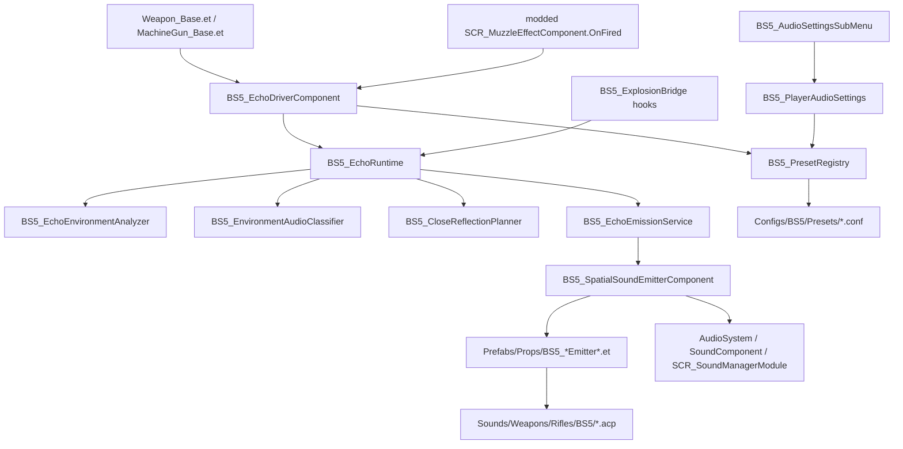

# Project map - BetterSounds5 Echo Module

Generated: 2026-05-15
Mod root: `G:\BettersMods\BettersMods\BetterSounds5_Echo_Module`
Active `.gproj`: `addon.gproj`

## Executive summary

`BetterSounds5_Echo_Module` is an Arma Reforger audio-extension mod. It adds runtime weapon tails, close slapbacks, explosion echoes, explosion slapbacks, configurable user audio settings, and technical presets for scan/trace/limiter behavior.

The runtime design is component/prefab driven:

- Weapon prefabs receive `BS5_EchoDriverComponent` plus debug/settings components.
- Muzzle-fire hooks enter through a modded `SCR_MuzzleEffectComponent.OnFired`.
- Explosion hooks enter through modded explosive/trigger classes and `BS5_ExplosionEchoEffect : BaseProjectileEffect`.
- Runtime analysis builds echo/slapback candidates from terrain, SoundWorld signals, entity queries, and traces.
- Playback is either managed through `SCR_SoundManagerModule` / `AudioSystem.PlayEvent` or through spawned emitter prefabs with `SoundComponent` and `BS5_SpatialSoundEmitterComponent`.

The highest-risk code is the runtime hot path:

- `Scripts/Game/BS5_EchoRuntime.c`
- `Scripts/Game/BS5_EchoDriverComponent.c`
- `Scripts/Game/BS5_EnvironmentAudioClassifier.c`
- `Scripts/Game/BS5_CloseReflectionPlanner.c`

The main audit theme should be duplicated analysis/dispatch, trace and entity-query cost, limiter correctness, resource fallback behavior, and UI/settings coupling.

## Current git/worktree state

Pre-map state:

- `git status --short --untracked-files=all`: clean.
- `git diff --stat`: clean.
- Recent history includes:
  - `997e135 Load EnfusionMCP handlers into BetterSounds5_Echo_Module`
  - `ecbd5c4 Expand explosion echo hooks and raise limiter caps`
  - `254bbba Add dedicated explosion echo and slapback ACPs`
  - `39b4b0b Fix BS5 cache and settings defaults`
  - `1cd5d76 Add BetterSounds5 echo module audit`
  - `e3894b6 Add project map for BetterSounds5 Echo Module`

This map intentionally adds `.agent-work/project-map.md`. `.agent-work/` did not exist before this mapping pass.

Note: `Scripts/WorkbenchGame/EnfusionMCP/` handler scripts are present in the mod tree from a previous Workbench/MCP setup commit. Treat them as tooling support, not gameplay runtime. Before publish/release, check whether `wb_cleanup` should remove them.

## Addon identity and dependencies

From `addon.gproj` and MCP `workshop_info`:

- ID: `BetterSounds5`
- GUID: `6717325A0F4513E2`
- Title: `BetterSounds5`
- Dependency: `58D0FB3206B6F859` (`Arma Reforger`, resolved by MCP `workshop_info`)

Important root files:

- `addon.gproj`: addon identity.
- `resourceDatabase.rdb`: Workbench resource database, about 24 KB at mapping time.
- `UserMaps.desc`: effectively empty, `UserMapDescClass {}`.
- `LICENSE`: MIT-style license file.

No current root `README.md`, `PROJECT_MAP.md`, or tracked markdown file was visible in the live working tree. Older git history mentions deleted/previous docs, but this artifact is the active map for future agents.

## Functional overview

The mod provides a BetterSounds-style echo/reflection system for weapons and explosions:

- Per-shot tails: long environmental tails for rifle, machine gun, and suppressed shots.
- Slapbacks: short reflection events from nearby walls/urban/trench/close-pocket geometry.
- Close reflection: separate close slapback planner and close slapback ACP/prefab.
- Explosion echo reuse: explosion and projectile-effect hooks route into the same analysis/emission stack with explosion-specific ACPs and emitter prefabs.
- Player settings: user-facing echo/slapback/close/explosion volume and preset controls injected into the vanilla audio settings menu.
- Technical presets: performance/quality tuning for scan radius, trace counts, SoundMap planner, limiter caps, and path validation.

## Entry points and runtime flow

### Weapon shot flow

1. `modded class SCR_MuzzleEffectComponent` in `Scripts/Game/BS5_EchoDriverComponent.c` overrides `OnFired`.
2. It calls `BS5_EchoRuntime.FindDriver(effectEntity, muzzle)`.
3. The resolved `BS5_EchoDriverComponent` runs `HandleWeaponFire`.
4. Driver resolves owner, suppression state, duplicate guard, cached result, and active budget.
5. `BS5_EchoRuntime.AnalyzeShot` builds `BS5_EchoAnalysisResult`.
6. `BS5_EchoRuntime.EmitShot` queues tails and slapbacks through `BS5_EchoEmissionService`.
7. Emission either plays managed audio directly or spawns an emitter prefab with `BS5_SpatialSoundEmitterComponent`.

### Explosion flow

1. `Scripts/Game/BS5_ExplosionBridge.c` hooks:
   - `SCR_WeaponBlastComponent.OnWeaponFired`
   - `SCR_ExplosiveTriggerComponent.TriggeredInSafetyDistance`
   - `SCR_PressureTriggerComponent.TriggeredInSafetyDistance`
   - `BS5_ExplosionEchoEffect.OnEffect`
2. All paths call `BS5_EchoRuntime.DispatchExplosionEffect(...)`.
3. Runtime suppresses near-duplicate explosion dispatches by origin.
4. Runtime resolves a local explosion driver entity from `Prefabs/Props/BS5_ExplosionDriver.et` when needed.
5. It analyzes and emits explosion-specific echo/slapback candidates through the same emission service.

### Settings flow

1. `modded class SCR_AudioSettingsSubMenu` procedurally adds BS5 rows into the vanilla audio settings tab.
2. UI writes values into `BS5_PlayerAudioSettings`.
3. `BS5_PlayerAudioSettings` persists through `BS5_GameAudioSettings : ModuleGameSettings`.
4. Preset changes use `BS5_PresetRegistry`, which loads config files and falls back to hardcoded defaults when config load fails.
5. Settings changes clear audio project caches through `BS5_SpatialSoundEmitterComponent.ClearAudioProjectCaches()`.

## Script map

| File | Responsibility | Key classes/functions | Dependencies | Risk notes |
| --- | --- | --- | --- | --- |
| `Scripts/Game/BS5_EchoTypes.c` | Shared data contracts, enums, result/context structs, math helpers. | `BS5_EchoAnalysisResult`, `BS5_PendingEmissionContext`, `BS5_EchoMath`. | All runtime, driver, UI/debug code. | Field drift breaks many consumers; treat as ABI-like. |
| `Scripts/Game/BS5_DebugLog.c` | Channel-aware logging facade. | `IsEnabled`, `Channel`, `ChannelEnabled`. | `BS5_EchoDriverComponent`, `BS5_AudioDebugSettingsComponent`. | Debug spam if prefab flags are enabled. |
| `Scripts/Game/BS5_AudioDebugSettingsComponent.c` | Debug component with channel/level flags. | `IsAnyDebugEnabled`, `GetDebugLevel`, `Allows`. | Prefabs with component defaults. | Prefab debug defaults can heavily affect runtime cost/log volume. |
| `Scripts/Game/BS5_CloseReflectionSettingsComponent.c` | Close slapback tuning and resource resolution. | `ResolveCloseSlapbackAcp`, `GetAcceptScoreMin`, `AllowRoofRescue`. | `BS5_CloseReflectionPlanner`, driver, close emitter/ACP resources. | Threshold tuning directly changes close echo presence. |
| `Scripts/Game/BS5_PlayerAudioSettings.c` | Persistent user audio settings. | `BS5_GameAudioSettings`, `Get/Set*`, `Save`, `LoadFromUserSettings`. | `ModuleGameSettings`, `BS5_PresetRegistry`, cache clear. | String-coupled module name and global cache invalidation. |
| `Scripts/Game/BS5_PresetRegistry.c` | Loads sound/technical presets from configs with hardcoded fallback. | `LoadSoundPresetsFromConfig`, `LoadTechnicalPresetsFromConfig`, `Apply*Preset`. | `Configs/BS5/Presets/*.conf`, `BaseContainerTools`, settings. | Silent fallback can hide broken configs. |
| `Scripts/Game/BS5_SpatialSoundEmitterComponent.c` | Playback helper on spawned emitter prefabs. | `Play`, `TryPlayAudioSystemProject`, `BuildAudioSystemSignals`, `SetSignalValue`. | `SoundComponent`, `SignalsManagerComponent`, `AudioSystem`, context. | Invalid project/event caching can suppress future playback; signal push cost. |
| `Scripts/Game/BS5_EnvironmentAudioClassifier.c` | SoundWorld/environment analysis and SoundMap/terrain candidate planner. | `BuildSnapshot`, `BS5_HybridTailPlanner.BuildCandidates`, `BS5_SoundMapAnchorPlanner.TryBuildCandidates`. | `SoundWorld`, terrain helper, game/entity signals, traces. | Highest analysis cost: terrain samples, signal reads, queries, traces. |
| `Scripts/Game/BS5_CloseReflectionPlanner.c` | Close-pocket slapback planner and scoring. | `Evaluate`, `TryAcceptDirect`, `TryAcceptRoofRescue`, `TryAcceptWallRescue`, `TraceProbeHit`. | Driver/settings, `BS5_EchoAnalysisResult`, traces. | Multiple acceptance paths and score blending should be audited carefully. |
| `Scripts/Game/BS5_EchoRuntime.c` | Runtime core: driver lookup, analysis, explosion dispatch, emission service, limiter. | `FindDriver`, `DispatchExplosionEffect`, `BS5_EchoEnvironmentAnalyzer`, `BS5_EchoEmissionService`. | All BS5 data/settings classes, engine audio/spawn/query/trace APIs. | Main hot path; duplicate suppression, caching, sorting, limiter, playback coexist. |
| `Scripts/Game/BS5_EchoDriverComponent.c` | Main weapon/explosion driver component and config surface. | `EOnInit`, `OnDelete`, `HandleWeaponFire`, `HandleExplosionFire`, `HandleExplosionAt`, nested settings/RPL components, modded `SCR_MuzzleEffectComponent.OnFired`. | Runtime, preset registry, debug settings, resource prefabs/ACPs. | Very large mixed config/lifecycle/routing/cache/limiter surface. |
| `Scripts/Game/BS5_ExplosionBridge.c` | Explosion hook bridge into BS5 runtime. | Modded explosive/trigger hooks, `BS5_ExplosionEchoEffect.OnEffect`. | `BS5_EchoRuntime.DispatchExplosionEffect`, base projectile effects. | Duplicate explosion fan-in depends on runtime suppression. |
| `Scripts/Game/UI/Menu/SettingsMenu/BS5_AudioSettingsSubMenu.c` | Procedural BS5 UI rows in vanilla audio settings. | `OnTabShow`, `OnChange`, row builders, refresh/flush/step helpers. | `SCR_AudioSettingsSubMenu`, `BS5_PlayerAudioSettings`, `BS5_PresetRegistry`. | Fragile against base menu/layout widget changes. |

## Script details

### `Scripts/Game/BS5_EchoTypes.c`

**Does:** Defines shared runtime contracts for candidates, analysis results, environment snapshots, pending emissions, active voices, debug enums, and math helpers.

**Classes/enums:**

- `BS5_EchoTypesClass : ScriptComponentClass`
- `BS5_EchoEnvironmentType`
- `BS5_TailProfileType`
- `BS5_VegetationClass`
- `BS5_EchoCandidateSourceType`
- `BS5_DebugChannel`
- `BS5_DebugLevel`
- `BS5_EchoReflectorCandidate`
- `BS5_EchoAnalysisResult`
- `BS5_EnvironmentSnapshot`
- `BS5_PendingEmissionContext`
- `BS5_ActiveEchoVoice`
- `BS5_EchoMath`

**Functions:**

- `BS5_EchoAnalysisResult.Reset()`: clears analysis fields.
- `BS5_EnvironmentSnapshot.Reset()`: clears environmental weights.
- `BS5_EchoMath.Clamp01`, `Clamp`, `MaxFloat`, `MinFloat`: local math helpers.
- `EnvironmentName`, `TailProfileName`, `CandidateSourceName`: debug/display conversion.
- `CloneCandidate`: deep-ish clone used when copying cached candidates.

**Depends on:** Enforce object/value types and all BS5 runtime consumers.

**Used by:** All runtime planning, emission, driver, debug, close reflection, and settings code.

**API/BIKI context checked:** No special engine API; this is local data code.

**Risks / audit targets:** Do not rename fields or enum values casually. These classes function as shared contracts across multiple large files.

### `Scripts/Game/BS5_DebugLog.c`

**Does:** Provides channel-aware logging wrappers so runtime systems can gate debug output through `BS5_AudioDebugSettingsComponent`.

**Classes:** `BS5_DebugLog`

**Functions:**

- `IsEnabled(driver, channel, level)`: resolves debug permission from driver settings.
- `Channel(driver, channel, message, level)`: prints channel-prefixed debug line.
- `Line`, `LineEnabled`, `ChannelEnabled`: low-level print helpers.
- `BoolText`: stable bool string.
- `ChannelName`: enum-to-text mapping.

**Depends on:** `BS5_EchoDriverComponent`, `BS5_AudioDebugSettingsComponent`, `BS5_DebugChannel`, `BS5_DebugLevel`.

**Used by:** Driver/runtime/emission logging.

**API/BIKI context checked:** Not needed beyond `Print` being normal Enforce logging.

**Risks / audit targets:** Runtime logs can be expensive in hot paths. Keep prefab debug defaults off for normal play.

### `Scripts/Game/BS5_AudioDebugSettingsComponent.c`

**Does:** Script component attached to BS5-enabled prefabs to control debug channel visibility.

**Classes:**

- `BS5_AudioDebugSettingsComponentClass : ScriptComponentClass`
- `BS5_AudioDebugSettingsComponent : ScriptComponent`

**Functions:**

- `IsAnyDebugEnabled()`: master debug status.
- `GetDebugLevel()`: maps int setting to `OFF`, `BASIC`, or `VERBOSE`.
- `Allows(channel, level)`: channel/level filter.

**Depends on:** `ScriptComponent`, `BS5_DebugChannel`, `BS5_DebugLevel`.

**Used by:** `BS5_DebugLog`, `BS5_EchoDriverComponent`.

**API/BIKI context checked:** MCP confirmed `ScriptComponent` is the Enfusion parent for script-created components and exposes owner/event-mask/component APIs.

**Risks / audit targets:** Check prefab defaults before performance tests. `Prefabs/Weapons/Core/Weapon_Base.et` and `Prefabs/Props/BS5_ExplosionDriver.et` currently set debug flags to 0 in inspected merged prefabs.

### `Scripts/Game/BS5_CloseReflectionSettingsComponent.c`

**Does:** Holds close reflection/slapback resource paths and scoring thresholds.

**Classes:**

- `BS5_CloseReflectionSettingsComponentClass : ScriptComponentClass`
- `BS5_CloseReflectionSettingsComponent : ScriptComponent`

**Functions:**

- `IsEnabled()`: close reflection master enable.
- `ResolveCloseSlapbackAcp()`: ACP override or default.
- `ResolveCloseSlapbackEmitterPrefab()`: emitter prefab override or default.
- `ResolveCloseSlapbackEventName()`: event name, normally `SOUND_SHOT`.
- `GetMaxCloseDistanceMeters()`: clamped close radius.
- `GetBaseEvidenceMin`, `GetAcceptScoreMin`, `GetSidePairAcceptScore`, `GetFrontBackPairAcceptScore`, `GetRescuePairAcceptScore`, `GetRoofSingleAcceptScore`, `GetTrenchOverrideMargin`: planner thresholds.
- `AllowRoofRescue`, `AllowWallRescue`: rescue path toggles.
- `GetIntensityMultiplier`, `GetReverbSendBoost`, `GetTailWidthScale`, `GetSurfaceHardnessFloor`: playback/signal tuning.

**Depends on:** `ScriptComponent`, `BS5_EchoMath`, close slapback ACP/prefab resources.

**Used by:** `BS5_EchoDriverComponent`, `BS5_CloseReflectionPlanner`, weapon and explosion driver prefabs.

**API/BIKI context checked:** `ScriptComponent` checked through MCP.

**Risks / audit targets:** The component clamps several authoring values. When tuning visuals/audio, verify effective values, not just prefab attributes.

### `Scripts/Game/BS5_PlayerAudioSettings.c`

**Does:** Defines persistent user settings and a static access layer for BS5 audio options.

**Classes:**

- `BS5_GameAudioSettings : ModuleGameSettings`
- `BS5_PlayerAudioSettings`

**Functions:**

- `GetEchoVolume` / `SetEchoVolume`
- `GetSlapbackVolume` / `SetSlapbackVolume`
- `GetSlapbackCloseVolume` / `SetSlapbackCloseVolume`
- `GetExplosionVolume` / `SetExplosionVolume`
- `IsSlapbackEnabled` / `SetSlapbackEnabled`
- `GetTechnicalPresetId` / `SetTechnicalPresetId`
- `GetSoundPresetId` / `SetSoundPresetId`
- `Save`
- `EnsureInitialized`
- `OnUserSettingsChanged`
- `LoadFromUserSettings`

**Depends on:** `ModuleGameSettings`, game user settings module name `BS5_GameAudioSettings`, `BS5_PresetRegistry`, `BS5_SpatialSoundEmitterComponent.ClearAudioProjectCaches()`.

**Used by:** UI settings menu, driver/preset runtime, spatial emitter signal generation.

**API/BIKI context checked:** MCP confirmed `ModuleGameSettings` is an Enfusion settings module base and documented `GetGame().GetGameUserSettings().GetModule(...)`, `UserSettingsChanged`, and `SaveUserSettings` workflow.

**Risks / audit targets:** Changing module or field names can break saved settings. Any settings change clears audio-project caches globally.

### `Scripts/Game/BS5_PresetRegistry.c`

**Does:** Loads sound and technical presets from config files and exposes lookup/apply APIs.

**Classes:**

- `BS5_SoundPresetRegistryConfig`
- `BS5_SoundPresetConfigEntry`
- `BS5_TechnicalPresetRegistryConfig`
- `BS5_TechnicalPresetConfigEntry`
- `BS5_SoundPreset`
- `BS5_TechnicalPreset`
- `BS5_PresetRegistry`

**Functions:**

- `GetDefaultSoundPresetId`, `GetDefaultTechnicalPresetId`, `GetCustomSoundPresetId`
- `GetSoundPresetCount`, `GetTechnicalPresetCount`
- `GetSoundPresetByIndex`, `GetTechnicalPresetByIndex`
- `GetSoundPreset`, `GetTechnicalPreset`, `GetActiveTechnicalPreset`
- `GetSoundPresetIndex`, `GetTechnicalPresetIndex`
- `GetSoundPresetDisplayName`, `GetTechnicalPresetDisplayName`
- `ApplySoundPreset`, `ApplyTechnicalPreset`
- `EnsureInitialized`
- `LoadSoundPresetsFromConfig`, `LoadTechnicalPresetsFromConfig`
- `AddFallbackSoundPresets`, `AddFallbackTechnicalPresets`
- `AddSoundPreset`, `AddTechnicalPresetFromEntry`
- `FillDefaultTechnicalPreset`, `FillLightTechnicalPreset`, `FillDynamicTechnicalPreset`
- `FindSoundPreset`, `FindTechnicalPreset`, `WrapIndex`

**Depends on:** `Configs/BS5/Presets/BS5_SoundPresets.conf`, `Configs/BS5/Presets/BS5_TechnicalPresets.conf`, `BaseContainerTools`, `BS5_PlayerAudioSettings`, `BS5_EchoMath`.

**Used by:** UI settings menu and driver accessors.

**API/BIKI context checked:** `mod validate` warns the custom config classes are not in the engine API index. That is expected for local script-defined config classes, not proof of invalid config.

**Risks / audit targets:** Silent fallback is useful for resilience but can hide broken `.conf` references. Any audit should verify whether config loading succeeds in-game or via Workbench reload.

### `Scripts/Game/BS5_SpatialSoundEmitterComponent.c`

**Does:** Attached to spawned emitter prefabs; plays requested ACP/event and pushes BS5 audio signals.

**Classes:**

- `BS5_SpatialSoundEmitterComponentClass : ScriptComponentClass`
- `BS5_SpatialSoundEmitterComponent : ScriptComponent`

**Functions:**

- `EOnInit(owner)`: resolve components on init.
- `IsReady()`: checks component availability.
- `Play(context, debugEnabled)`: main emitter playback path.
- `TryPlayAudioSystemProject(context, transform, signalNames, signalValues)`: direct `AudioSystem.PlayEvent` attempt.
- `EnsureAudioProjectReady(project)`: initializes ACP project and caches known invalid projects.
- `BuildAudioProjectEventKey`, `IsAudioProjectEventKnownInvalid`, `MarkAudioProjectEventInvalid`, `ClearAudioProjectCaches`, `EnsureAudioProjectCaches`: audio project/event caches.
- `BuildAudioSystemSignals(context, signalNames, signalValues)`: converts BS5 context into signal names/values.
- `AppendAudioSignal`, `GetSlapbackModeSignal`: signal helpers.
- `ResolveComponents`: finds `SoundComponent` and `SignalsManagerComponent`.
- `ApplyAudioSignals`, `SetSignalValue`: pushes signals through both signals manager and sound component where possible.

**Depends on:** `SoundComponent`, `SignalsManagerComponent`, `AudioSystem`, `BS5_PendingEmissionContext`, `BS5_PlayerAudioSettings`.

**Used by:** Emitter prefabs under `Prefabs/Props/BS5_*.et`, `BS5_EchoEmissionService`.

**API/BIKI context checked:** MCP confirmed:

- `AudioSystem.PlayEventInitialize(project)` and `AudioSystem.PlayEvent(project, eventName, transform, names, values)`.
- `BaseSoundComponent` / sound component APIs including `GetEventIndex`, `SetSignalValueStr`, `PlayStr`, `UpdateTrigger`.

**Risks / audit targets:** Invalid ACP/event caching can suppress future playback after transient failures. Signal lists are rebuilt per emission.

### `Scripts/Game/BS5_EnvironmentAudioClassifier.c`

**Does:** Reads environment and sound-map data, then builds tail/reflection candidates with terrain, facade, SoundWorld, entity query, and trace logic.

**Classes:**

- `BS5_EnvironmentAudioClassifier`
- `BS5_HybridTailPlanner`
- `BS5_SoundMapAnchorSample`
- `BS5_SoundMapAnchorPlanner : BS5_HybridTailPlanner`

**Functions:**

- `BuildSnapshot(settings, owner, origin, flatForward, flatRight, result)`: creates environment snapshot from game/audio/terrain signals.
- `ReadSignalArray`, `ReadGlobalSignal`, `ReadEntitySignal`, `ReadEntitySignalComponent`: signal reads.
- `SampleTerrainBias`, `ResolveDominantVegetation`, `ResolveTerrainHeight`, `ResolveTerrainNormal`: terrain/environment helpers.
- `BS5_HybridTailPlanner.BuildCandidates`: main hybrid planner.
- `CollectSectorFieldCandidates`, `CollectForwardFacadeMicroCandidates`, `CollectForwardFacadeEntityCandidates`: candidate searches.
- `ResolveTailProfile`, `ResolveTargetCount`, `ResolveProfileMaxDistance`: profile selection.
- `BuildAnchorCandidate`, `CollectSettlementFacadeCandidates`, `AddProfileFallbackCandidates`: anchor generation.
- `ResolveEntityGeometryHit`, `ResolveGeometryHit`, `PathTraceRejectsCandidate`: trace validation.
- `BS5_SoundMapAnchorPlanner.TryBuildCandidates`: SoundMap-specific candidate path.
- `CollectForwardSamples`, `AddForwardFallbacks`, `AddOmniContextAnchors`, `EvaluateSoundMapPathPlausibility`, `ValidateTerrainProfileCandidate`: SoundMap/terrain filtering.

**Depends on:** `BS5_EchoDriverComponent`, `BS5_EchoAnalysisResult`, `BS5_EchoReflectorCandidate`, `BS5_EchoMath`, `SCR_TerrainHelper`, `SoundWorld`, `GameSignalsManager`, `SignalsManagerComponent`, entity prefab data, trace APIs.

**Used by:** `BS5_EchoRuntime` analysis.

**API/BIKI context checked:** MCP confirmed:

- `BaseWorld.QueryEntitiesBySphere(center, radius, addEntity, filterEntity, flags)`.
- `ChimeraCharacter.TraceMoveWithoutCharacters(BaseWorld world, inout TraceParam param)`, documented as an optimized TraceMove variant that filters character entities.

**Risks / audit targets:** Highest likely analysis cost. Watch repeated terrain sampling, entity queries, trace counts, path plausibility validation, urban micro-scan, and duplicated scoring between hybrid and SoundMap paths.

### `Scripts/Game/BS5_CloseReflectionPlanner.c`

**Does:** Decides whether a close-pocket slapback should be created from wall candidates and optional roof/wall rescue traces.

**Classes:**

- `BS5_CloseReflectionProbeHit`
- `BS5_CloseReflectionPlannerResult`
- `BS5_CloseReflectionSupportPoint`
- `BS5_CloseReflectionEvidence`
- `BS5_CloseReflectionPlanner`

**Functions:**

- `Evaluate(...)`: main close reflection decision.
- `CollectEvidence`, `AssignDirectionalContributor`, `ResolveBestSupport`, `ResolveCoverageScore`, `ResolveRayDensityScore`, `ResolveBaseEvidence`.
- `TryAcceptDirect`: accepts from direct side/front/back/corner evidence.
- `TryAcceptRoofRescue`, `TryAcceptWallRescue`: extra traces for close-pocket rescue.
- `TraceProbeHit`: uses trace API and wall/roof normal checks.
- `BuildCloseCandidate`, `CreateCloseCandidate`: converts support points into a candidate.
- `GetPlanarDirection`, `BuildFlatRight`: direction helpers.

**Depends on:** `BS5_EchoDriverComponent`, `BS5_CloseReflectionSettingsComponent`, `BS5_EchoAnalysisResult`, `BS5_EchoReflectorCandidate`, `BS5_EchoMath`, `BS5_EchoEnvironmentAnalyzer`, trace APIs.

**Used by:** `BS5_EchoRuntime` / environment analysis flow when close reflection is enabled.

**API/BIKI context checked:** MCP confirmed `ChimeraCharacter.TraceMoveWithoutCharacters`.

**Risks / audit targets:** Multiple acceptance branches can produce surprising behavior. Check whether direct, roof rescue, wall rescue, and trench override interact as intended.

### `Scripts/Game/BS5_EchoRuntime.c`

**Does:** Central runtime dispatcher and emission service. Hosts several classes/subsystems in one file.

**Classes:**

- `BS5_EchoRuntime`
- `BS5_EchoEnvironmentAnalyzer`
- `BS5_EchoEmissionService`

The file also contains local planner helpers and references `BS5_SoundMapAnchorPlanner`/candidate-building flows.

**Key functions:**

- `FindDriver(effectEntity, muzzle)`: weapon-shot driver lookup.
- `FindExplosionDriver(effectEntity, muzzle, projectileEntity)`: explosion driver lookup.
- `DispatchExplosionEffect(owner, pHitEntity, outMat, damageSource, instigator, sourceTag)`: bridge entry for explosion echo.
- `AnalyzeShot`, `AnalyzeExplosion`: analysis wrappers.
- `EmitShot`, `EmitExplosion`: emission wrappers.
- `TryFindDriverOnEntity`: component lookup.
- `ShouldSuppressExplosionDispatch`: near-duplicate explosion suppression.
- `ResolveGlobalExplosionDriver`: spawns/uses `BS5_ExplosionDriver.et`.
- `BS5_EchoEnvironmentAnalyzer.Analyze`: primary analysis.
- `CollectTailReflectorCandidates`, `CollectSlapbackCandidates`, `CollectSlapbackEntityCandidates`: geometry-based candidate collection.
- `BS5_EchoEmissionService.Emit`: queues all selected emissions.
- `QueueEmission`, `EmitPending`, `EmitOnEmitter`: emission lifecycle.
- `TryPlayManagedAudioSource`, `TryPlayManagedAudioSourceEvent`: `SCR_SoundManagerModule` path.
- `SpawnEmitterEntity`, `ResolveEmitterPrefabResource`: prefab fallback path.
- `ReservePendingVoice`, `TryAdmitPlaybackVoice`, `StealPlaybackVoice`, `RegisterActiveVoice`, `UnregisterActiveVoice`: limiter/voice pool.
- `TryEnterStartGate`, `DeferOrDropAtStartGate`: burst/start limiter.
- `CleanupEmitter`, `ReleaseAndCleanupEmitter`: cleanup.
- `ComputeDistanceGain`, `ComputeSlapbackDistanceGain`, `ResolveUserSlapbackVolumeForSourceType`: gain/user volume helpers.

**Depends on:** Nearly every BS5 script file, `Resource.Load`, `SpawnEntityPrefab`, `SCR_SoundManagerModule`, `AudioSystem`, `SoundComponent`, `BaseWorld` query/trace APIs, engine callqueue/timers.

**Used by:** Weapon hook, explosion bridge, driver component.

**API/BIKI context checked:** MCP confirmed:

- `SCR_SoundManagerModule.GetInstance(World)` and `CreateAudioSource(...)` overloads.
- `AudioSystem.PlayEvent`, `PlayEventInitialize`, `IsSoundPlayed`, `TerminateSoundFadeOut`.
- `BaseProjectileEffect.OnEffect` for the explosion effect bridge.
- `QueryEntitiesBySphere` and `TraceMoveWithoutCharacters`.

**Risks / audit targets:** This is the main hot path. Audit duplicate dispatch suppression, explosion-driver reuse, cache lifetime/generation, active voice ownership, steal policy, managed audio fallback, invalid resource caches, and heavy debug string construction.

### `Scripts/Game/BS5_EchoDriverComponent.c`

**Does:** Main component attached to BS5-enabled weapon/explosion driver prefabs. Owns most authoring attributes, resource resolution, cache state, limiter config, and shot/explosion entry handling.

**Classes:**

- `BS5_EchoDriverComponentClass : ScriptComponentClass`
- `BS5_EchoDriverComponent : ScriptComponent`
- `BS5_WeaponEchoSettingsComponentClass : ScriptComponentClass`
- `BS5_WeaponEchoSettingsComponent : ScriptComponent`
- `BS5_WeaponEchoRplCharacterComponentClass : ScriptComponentClass`
- `BS5_WeaponEchoRplCharacterComponent : ScriptComponent`
- `modded class SCR_MuzzleEffectComponent`

**Key functions:**

- `EOnInit(owner)`: init and optional config validation.
- `OnDelete(owner)`: cleanup, cancel contexts.
- `HandleWeaponFire(effectEntity, muzzle, projectileEntity)`: normal shot path.
- `HandleExplosionFire(effectEntity, muzzle, projectileEntity)`: weapon blast path.
- `HandleExplosionAt(owner, origin, forward, requireExplosionEnabled)`: explosion dispatch path.
- `ResolveMasterAcp`, `ResolveSlapbackAcp`, `ResolveExplosionAcp`, `ResolveExplosionSlapbackAcp`: ACP path resolution.
- `Resolve*EmitterPrefab`: emitter prefab path resolution.
- Dozens of `Get*` methods: clamp and merge prefab values, technical presets, and user settings.
- `TryGetTailSectorCache`, `StoreTailSectorCache`, `TryGetForwardFacadeNegativeCache`, `StoreForwardFacadeNegativeCache`: analysis caching.
- `ShouldSuppressDuplicateDispatch`, `ShouldEmitShotForPlaybackLimiter`, `ResetPlaybackLimiterBurst`, `ActivateDispatchGuard`, `ClearDispatchGuard`: duplicate and limiter guard logic.
- `GetSettingsComponent`, `GetCloseReflectionSettingsComponent`, `GetDebugSettingsComponent`, `GetCharacterComponent`: sibling component lookup.
- `DebugValidateConfiguration`: debug-only sanity output.
- `SCR_MuzzleEffectComponent.OnFired`: weapon hook.

**Depends on:** `ScriptComponent`, runtime core, debug/settings/close components, preset registry, player settings, prefabs and ACPs under `Prefabs/Props/BS5_*` and `Sounds/Weapons/Rifles/BS5/*`.

**Used by:** Weapon base prefabs, explosion driver prefab, runtime emission.

**API/BIKI context checked:** `ScriptComponent` and audio/resource APIs checked through MCP. The subagent reported the hook surface as valid; future implementation should still re-check exact override signatures before changing modded hooks.

**Risks / audit targets:** This is a very large mixed-responsibility component. Keep changes narrow. Main audit areas are config clamps, preset overrides, duplicate guards, cache key semantics, callqueue timers, resource fallback paths, and machine-gun/suppressed/explosion special cases.

### `Scripts/Game/BS5_ExplosionBridge.c`

**Does:** Routes vanilla explosion-related events into BS5 explosion echo runtime.

**Classes:**

- `modded class SCR_WeaponBlastComponent`
- `modded class SCR_ExplosiveTriggerComponent`
- `modded class SCR_PressureTriggerComponent`
- `BS5_ExplosionEchoEffect : BaseProjectileEffect`

**Functions:**

- `SCR_WeaponBlastComponent.OnWeaponFired`: calls driver `HandleExplosionFire`, then `super`.
- `SCR_ExplosiveTriggerComponent.TriggeredInSafetyDistance`: dispatches explosion effect, then `super`.
- `SCR_PressureTriggerComponent.TriggeredInSafetyDistance`: dispatches explosion effect, then `super`.
- `BS5_ExplosionEchoEffect.OnEffect`: dispatches projectile effect, no additional local behavior.

**Depends on:** `BS5_EchoRuntime.DispatchExplosionEffect`, `BS5_EchoRuntime.FindExplosionDriver`, `BaseProjectileEffect`.

**Used by:** Explosion-capable prefabs through script hooks and `BS5_ExplosionEchoEffect` in projectile effect arrays.

**API/BIKI context checked:** MCP confirmed `BaseProjectileEffect.OnEffect(...)` signature. Other modded override signatures should be re-checked immediately before editing this file.

**Risks / audit targets:** There are multiple possible fan-in paths for one explosion. Runtime suppression by origin is critical.

### `Scripts/Game/UI/Menu/SettingsMenu/BS5_AudioSettingsSubMenu.c`

**Does:** Modifies the vanilla audio settings tab to add BS5 controls.

**Classes:**

- `modded class SCR_AudioSettingsSubMenu`

**Functions:**

- Lifecycle: `OnTabShow`, `OnTabHide`, `OnMenuHide`, `OnTabRemove`.
- Input: `OnChange`, `OnClick`, `OnMouseButtonDown`, `OnMouseButtonUp`.
- Row creation: `EnsureBs5EchoVolumeRow`, `EnsureBs5SlapbackVolumeRow`, `EnsureBs5SlapbackCloseVolumeRow`, `EnsureBs5SlapbackEnabledRow`, `EnsureBs5TechnicalPresetRow`, `EnsureBs5SoundPresetRow`, `EnsureBs5ExplosionVolumeRow`.
- Shared UI builders: `CreateBs5PresetRow`, `CreateBs5Button`, `CreateBs5BaseRow`, `CreateBs5SizedShell`, `GetBs5SettingsContent`.
- Cleanup/ref finding: `RemoveExistingBs5ProceduralRows`, `IsBs5ProceduralRowName`, `ClearBs5RowWidgetRefs`, `FindBs5ReferenceAudioRow`, `FindBs5FirstSliderWidget`, `CollectBs5TextWidgets`, `FindBs5LabelTextWidget`, `FindBs5ValueTextWidget`.
- Refresh/flush: per-volume refresh/changed/flush methods plus `FlushBs5PendingSettings`, `RefreshBs5PresetRows`, `StepBs5TechnicalPreset`, `StepBs5SoundPreset`.

**Depends on:** Vanilla `SCR_AudioSettingsSubMenu` widget structure, `BS5_PlayerAudioSettings`, `BS5_PresetRegistry`.

**Used by:** In-game audio settings menu.

**API/BIKI context checked:** Not deeply verified in this pass. Future UI edits should inspect current vanilla settings menu/widget patterns.

**Risks / audit targets:** Procedural UI injection is fragile if vanilla widget hierarchy, row naming, or event behavior changes.

## Prefabs/configs/layouts/resources

### Key prefabs

MCP inspected representative prefabs:

- `Prefabs/Weapons/Core/Weapon_Base.et`
  - Core BS5 weapon entry point.
  - Components: `BS5_AudioDebugSettingsComponent`, `BS5_CloseReflectionSettingsComponent`, `BS5_EchoDriverComponent`, `BS5_WeaponEchoRplCharacterComponent`, `BS5_WeaponEchoSettingsComponent`.
  - References rifle/suppressed/slapback/trench/explosion ACPs and BS5 emitter prefabs.

- `Prefabs/Weapons/Core/MachineGun_Base.et`
  - Inherits from `Weapon_Base.et`.
  - Overrides `BS5_EchoDriverComponent` and `BS5_WeaponEcho*` resources for `Weapons_MG_EchoMaster.acp.acp` and `BS5_TailEmitter_MG.et`.
  - Tightens limiter/lifetime values for machine-gun fire.

- `Prefabs/Props/BS5_ExplosionDriver.et`
  - Standalone runtime driver for explosion dispatch.
  - Components: `BS5_AudioDebugSettingsComponent`, `BS5_CloseReflectionSettingsComponent`, `BS5_EchoDriverComponent`.
  - References explosion echo/slapback ACPs and explosion emitter prefabs.

- `Prefabs/Props/BS5_TailEmitter.et`
  - Components: `BS5_SpatialSoundEmitterComponent`, `SoundComponent`, `SignalsManagerComponent`.
  - SoundComponent references `Weapons_Rifles_EchoMaster.acp`.

- `Prefabs/Props/BS5_*Emitter*.et`
  - Same general pattern: `SoundComponent` owns ACP reference, `SignalsManagerComponent` carries signal state, `BS5_SpatialSoundEmitterComponent` bridges runtime context to playback.

- `Prefabs/Weapons/Core/Grenade_Base.et`
  - MCP inspect confirmed `GrenadeMoveComponent.ProjectileEffects` includes `BS5_ExplosionEchoEffect`.

Other notable prefab surfaces:

- `Prefabs/Weapons/Core/Ammo_GrenadeLauncher_Base.et`
- `Prefabs/Weapons/Core/Explosives_base.et`
- `Prefabs/Weapons/Ammo/Ammo_Rocket_M72A3.et`
- `Prefabs/Weapons/Grenades/Grenade_M67.et`
- `Prefabs/Weapons/Grenades/Grenade_RGD5.et`
- `Prefabs/Weapons/Core/Handgun_Base.et`
- `Prefabs/Weapons/Core/LongRangeRifle_Base.et`
- `Prefabs/Weapons/MachineGuns/M60/MG_M60_base.et`
- `Prefabs/Characters/Core/Character_Base.et`

### Configs

- `Configs/BS5/Presets/BS5_SoundPresets.conf`
  - Root class: `BS5_SoundPresetRegistryConfig`
  - Entries:
    - `vanilla`
    - `bettersounds_v4`
    - `bettersounds_v5`
    - `lunacy_audio`
  - Values: echo/slapback/close/explosion volume multipliers.

- `Configs/BS5/Presets/BS5_TechnicalPresets.conf`
  - Root class: `BS5_TechnicalPresetRegistryConfig`
  - Entries:
    - `default`
    - `light`
    - `dynamic`
  - Values: scan radius, trace counts, candidate caps, emitter caps, limiter thresholds, SoundMap planner settings, terrain/path validation, and urban micro-scan.

### Sounds and audio assets

Main ACPs under `Sounds/Weapons/Rifles/BS5/`:

- `Weapons_Rifles_EchoMaster.acp`
- `Weapons_MG_EchoMaster.acp.acp`
- `Weapons_Silinced_EchoMaster.acp.acp`
- `Weapons_Slapbacks_Master.acp`
- `Weapons_Slapbacks_Close_Master.acp`
- `Weapons_Slapbacks_Silinced_Master.acp`
- `Weapons_Slapbacks_Trench_Master.acp`
- `Weapons_Explosions_EchoMaster.acp`
- `Weapons_Explosions_Slapbacks_Master.acp`

BS5 signal resources include:

- `Sounds/_SharedData/Signals/BS5/BS5_Intensity.sig`
- `Sounds/_SharedData/Signals/BS5/BS5_UserExplosionVolume.sig`
- `Sounds/_SharedData/Signals/BS5/BS5_UserSlapbackVolume.sig`
- `Sounds/_SharedData/Signals/BS5/BS5_UserSlapbackCloseVolume.sig`
- `Sounds/Weapons/Rifles/BS5/multiply.sig`

Asset directories are mostly audio samples:

- `Assets/BulletSounds/`
- `Assets/explosions/`
- `Assets/Gunpowder/SlapBacks/`
- `Assets/Gunpowder/Tails/City/`
- `Assets/Gunpowder/Tails/Field/`
- `Assets/Gunpowder/Tails/Forest/`
- `Assets/Gunpowder/Tails/SC_Reflectors/`

Naming smells to preserve as audit notes, not immediate conclusions:

- `Silinced`
- `Explsion`
- `SemiMId`
- `.acp.acp`
- `.mp3.wav`
- `.wav.wav`

These names may already be baked into resource GUIDs and references. Do not bulk-rename without Workbench/resource database handling.

### Layouts/localization/worlds

No `Layouts/`, `UI/` layout files, `Language/`, `Worlds/`, or `Missions/` directories were found in the current live tree. UI is injected procedurally in script.

## Dependency graph

## Enfusion API / BIKI / vanilla context checked

MCP tools available and used in this session included consolidated `project`, `prefab`, `mod`, `workshop_info`, `api_search`, and related Enfusion/Arma tools. Older README-style aliases such as `project_browse` or `prefab_inspect` were not assumed; active tool names were used.

Checked API surfaces:

- `ScriptComponent`
  - Parent for script-created components.
  - Relevant methods include `GetOwner`, `SetEventMask`, `ClearEventMask`, `FindComponent`, `Activate`, `Deactivate`.

- `AudioSystem`
  - `PlayEventInitialize(string resourceName)`
  - `PlayEvent(string resourceName, string eventName, vector transf[], array<string> names = null, array<float> values = null)`
  - `IsSoundPlayed(AudioHandle handle)`
  - `TerminateSoundFadeOut(AudioHandle handle, bool fade, float fadeTime)`

- `BaseSoundComponent` / sound component surface
  - `GetEventIndex`
  - `SetSignalValue`
  - `SetSignalValueStr`
  - `PlayStr`
  - `UpdateTrigger`

- `SCR_SoundManagerModule`
  - `GetInstance(World world)`
  - `CreateAudioSource(...)` overloads, including custom config and world-position variants.
  - `PlayAudioSource(...)`

- `BaseWorld.QueryEntitiesBySphere`
  - Signature verified as `QueryEntitiesBySphere(vector center, float radius, QueryEntitiesCallback addEntity, QueryEntitiesCallback filterEntity = null, EQueryEntitiesFlags queryFlags = EQueryEntitiesFlags.ALL)`.

- `ChimeraCharacter.TraceMoveWithoutCharacters`
  - Signature verified as `static float TraceMoveWithoutCharacters(BaseWorld world, inout TraceParam param)`.
  - MCP notes it is an optimized TraceMove variant filtering out character entities.

- `ModuleGameSettings`
  - MCP docs confirm it defines a settings module and show `GetGame().GetGameUserSettings().GetModule(...)` workflow.

- `BaseProjectileEffect`
  - `OnEffect(IEntity pHitEntity, inout vector outMat[3], IEntity damageSource, notnull Instigator instigator, string colliderName, float speed)` verified.

Validation:

- MCP `mod validate` with structure/gproj/scripts/prefabs/configs/references/naming checks passed:
  - `structure`
  - `gproj`
  - `scripts`
  - `prefabs`

Validator warnings:

- Custom config root/classes (`BS5_SoundPresetRegistryConfig`, `BS5_SoundPresetConfigEntry`, `BS5_TechnicalPresetRegistryConfig`, `BS5_TechnicalPresetConfigEntry`) are not in the API index.
- `BS5_HybridTailPlanner` is not in the API index.
- Naming info noted `SCR_` prefix classes versus common `EMCP_` due to Workbench handler scripts.

Interpretation: those warnings are expected for local script-defined classes and present handler scripts. They are not confirmed gameplay errors by themselves.

## Performance-sensitive surfaces

Primary hot path candidates:

- `BS5_EchoRuntime.c`
  - Candidate analysis and emission queue.
  - Duplicate explosion suppression.
  - Voice limiter and stealing.
  - Start gate / burst limiting.
  - Resource load/cache and emitter spawn fallback.

- `BS5_EchoDriverComponent.c`
  - Per-shot entry, duplicate guards, cache access, callqueue timers, and all runtime tuning accessors.

- `BS5_EnvironmentAudioClassifier.c`
  - SoundWorld signal sampling.
  - Terrain sampling.
  - Entity queries.
  - `TraceMoveWithoutCharacters`.
  - SoundMap path plausibility and urban micro-scan.

- `BS5_CloseReflectionPlanner.c`
  - Extra close wall/roof rescue traces and pair scoring.

- `BS5_SpatialSoundEmitterComponent.c`
  - Audio project init/cache.
  - Signal setting.
  - Direct `AudioSystem.PlayEvent` plus fallback to `SoundComponent`.

Prefab/config surfaces influencing runtime cost:

- `BS5_TechnicalPresets.conf`
  - `m_fScanRadius`
  - `m_iMaxCandidateCount`
  - `m_iMaxTraceCount`
  - `m_iForwardAnchorTraceCount`
  - `m_iLateralAnchorTraceCount`
  - `m_iSoundMapForwardRayCount`
  - `m_iSoundMapForwardSampleCount`
  - `m_iSoundMapPathSampleCount`
  - `m_iSoundMapUrbanMicroMaxEntities`
  - `m_iLimiterMaxTailStartsPer100Ms`
  - `m_iLimiterMaxSlapbackStartsPer100Ms`

Debug surfaces:

- `BS5_AudioDebugSettingsComponent`
- `BS5_DebugLog`
- Long debug summaries in `BS5_EchoRuntime.c`
- `DebugValidateConfiguration` in `BS5_EchoDriverComponent.c`

Keep debug disabled during performance testing unless specifically gathering logs.

## AI-slop risk targets for audit

Prioritize these in a future `v2-bhe-audit`:

1. `BS5_EchoRuntime.c`
   - Very large file with multiple subsystems.
   - Duplicate suppression, analysis, emission, resource cache, limiter, and cleanup are intertwined.
   - Audit for duplicate work, cache key correctness, stale invalid caches, and missed cleanup.

2. `BS5_EchoDriverComponent.c`
   - Huge attribute surface and many clamps/fallbacks.
   - Audit for duplicate calculations, inconsistent defaults between prefab/config/hardcoded values, and special-case drift.

3. `BS5_EnvironmentAudioClassifier.c`
   - Trace/entity-query/terrain/signal-heavy.
   - Audit for repeated expensive queries, duplicated classification math, incorrect thresholds, and overly broad fallback generation.

4. `BS5_CloseReflectionPlanner.c`
   - Multiple acceptance paths with score blending.
   - Audit for impossible thresholds, overlapping acceptance, and rescue paths fighting trench logic.

5. `BS5_PresetRegistry.c`
   - Silent hardcoded fallback can mask broken config references.
   - Audit with Workbench reload or runtime logs if presets appear wrong.

6. `BS5_AudioSettingsSubMenu.c`
   - Procedural UI injected into vanilla menu.
   - Audit only when UI behavior is in scope; avoid refactoring during audio runtime fixes.

7. Resources and naming
   - Double extensions and misspellings are likely historical resource names.
   - Do not rename without a Workbench/resource database plan.

8. `Scripts/WorkbenchGame/EnfusionMCP/`
   - Handler scripts are tooling files.
   - Keep out of gameplay reasoning and remove before publish/release if required.

## Open questions / unverified assumptions

- The dependency GUID `58D0FB3206B6F859` was resolved by MCP as Arma Reforger; no other mod dependency is declared in `addon.gproj`.
- The map did not launch Workbench and did not run script reload/compile. MCP `mod validate` was used as cheap validation only.
- Exact override signatures for `SCR_WeaponBlastComponent`, `SCR_ExplosiveTriggerComponent`, `SCR_PressureTriggerComponent`, and `SCR_AudioSettingsSubMenu` were not deeply re-verified beyond current script presence and one subagent note. Re-check with MCP/API or base-game scripts before editing those hooks.
- Resource existence was not exhaustively verified for every ACP sample and base-game GUID. ACPs reference many base-game/shared audio resources; simple local missing-path scans are not reliable proof of broken references.
- Existing older docs mentioned in git history were not present in the live working tree and were not treated as current truth.
- The current map is read-only research plus this artifact write. It does not assert runtime behavior was smoke-tested in-game.

## Subagent evidence

- `api_researcher / native equivalent`: not used; main agent performed targeted MCP API checks.
- `code_researcher / native equivalent`: used; purpose was read-only `Scripts/Game` class/function/dependency/performance mapping; returned per-file responsibilities and audit-risk focus; files changed by subagent: none.
- `repo_sentinel / native equivalent`: not used.
- `heavy_advisor / native equivalent`: not used.
- `resource_mapper / native explorer equivalent`: used; purpose was read-only addon/prefab/config/audio resource mapping; returned addon identity, prefab entry points, ACP/signal resources, stale-looking naming, handler-script hygiene note; files changed by subagent: none.
- Files changed by subagents: none.

## Recommended next skill

Use `v2-bhe-audit` next if the goal is cleanup/deslop planning. The first audit slice should focus on:

- Runtime duplicate work and hot path math: `BS5_EchoRuntime.c`, `BS5_EchoDriverComponent.c`, `BS5_EnvironmentAudioClassifier.c`.
- Explosion duplicate fan-in: `BS5_ExplosionBridge.c` plus `BS5_EchoRuntime.DispatchExplosionEffect`.
- Preset/config fallback correctness: `BS5_PresetRegistry.c` and `Configs/BS5/Presets/*.conf`.

Use `bhe-goal` instead if the next request is a concrete bugfix or feature change.
